<p align="center">
  
</p>

<div align="center">
  <h1>Elephant Agent</h1>
  <p>
    <strong>Do more without thinking less.</strong><br />
    A Mother Elephant that grows to understand you, then helps shape the paths you want to move.
  </p>
  <p>
    <a href="https://elephant.agentic-in.ai/">Website</a>
    ·
    <a href="https://elephant.agentic-in.ai/blog/personal-ai-you-create/">Blog</a>
    ·
    <a href="https://elephant.agentic-in.ai/paper/">Paper</a>
  </p>
</div>


## What It Is

Elephant Agent is L4 personal AI: it starts from the person, not the task.

The mother elephant grows a correctable **Personal Model** of who you are, what
surrounds you, what is alive right now, and what your path has taught you. That
understanding keeps deepening through interaction, correction, and gentle
questions.

Once Elephant Agent understands enough, it can help design living **Paths**:
work, health, habits, learning, relationships, recovery, research, code, and any
other long-running direction you want to move. It can break a Path into Steps,
bring in baby elephants when useful, and return to you at Checkpoints where your
judgment matters.

## Personal Agent Levels

<p align="center">
  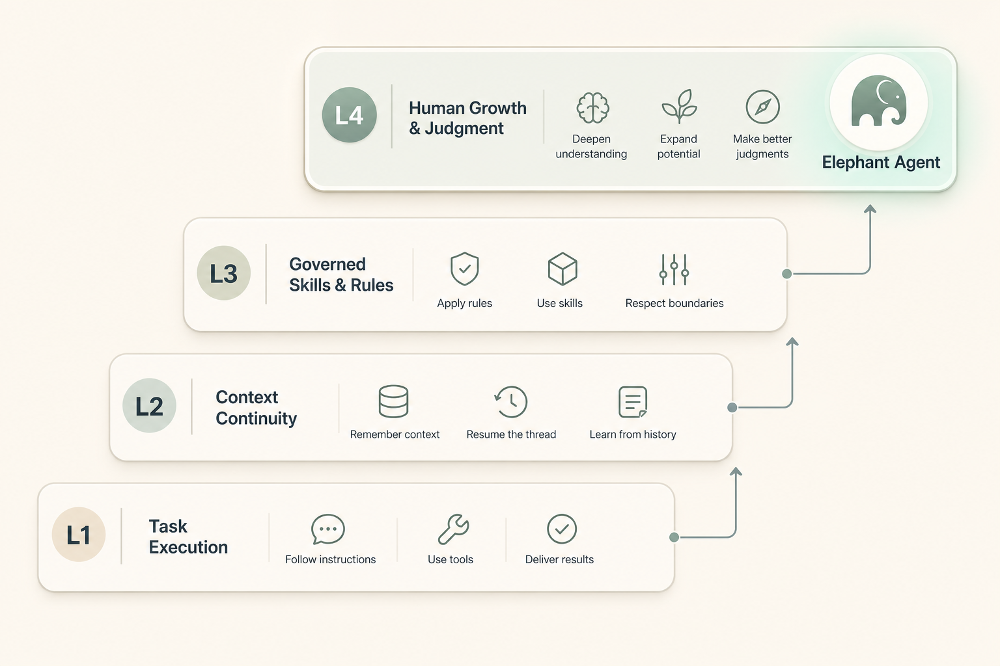
</p>

<table>
  <tr>
    <td width="25%">
      <strong>L1</strong>
      <br />
      <strong>Executes tasks.</strong>
      <br />
      <sub>Claude Code, Cursor, Devin, and Codex-style agents make execution cheaper and faster.</sub>
    </td>
    <td width="25%">
      <strong>L2</strong>
      <br />
      <strong>Carries context.</strong>
      <br />
      <sub><a href="https://openclaw.ai/">OpenClaw</a> publicly emphasizes local agents, persistent memory, full system access, skills, plugins, and integrations.</sub>
    </td>
    <td width="25%">
      <strong>L3</strong>
      <br />
      <strong>Improves procedures.</strong>
      <br />
      <sub><a href="https://hermes-ai.net/">Hermes Agent</a> publicly positions itself around a self-improving learning loop, skill creation, recall, and user modeling.</sub>
    </td>
    <td width="25%">
      <strong>L4</strong>
      <br />
      <strong>Grows the human.</strong>
      <br />
      <sub>Elephant Agent's product position: Mother understands the person, shapes Paths, and keeps judgment, evidence, questions, and growth with the human.</sub>
    </td>
  </tr>
</table>

## From Understanding to Paths

Understanding is not the destination. It is how Elephant Agent helps you return
to the right thread and keep moving.

- **Mother** is the coordinating elephant. She starts from the Personal Model,
  proposes Paths, chooses the next Steps, and knows when to ask.
- **Path** is any ongoing direction you want to move: a codebase, a fitness
  plan, a habit reset, a research arc, a relationship repair, or a life
  transition.
- **Step** is a concrete action inside a Path. It replaces the narrower language
  of "issue" for the user-facing product.
- **Flow** is the visible board for a Path: later, next, moving, checking, done,
  stuck, or dropped.
- **Checkpoint** is where the human judgment returns. Mother can ask first or
  keep moving inside a trusted boundary.
- **Learning Summary** is the completion receipt for a Step. It explains what
  happened, why it happened, how it happened, what knowledge mattered, and what
  should strengthen Mother, the baby, or the user's Journey.
- **Herd** is the group of baby elephants that can help a Path. Babies do bounded
  work; Mother keeps the whole shape coherent.

The target product loop is simple: chat with Mother, let her organize the Paths
and Steps, answer Checkpoints when needed, and still be able to drag Steps
manually when the board is the clearer surface.

Every completed Step should also close an understanding loop. A baby does not
only say "done"; it returns a Learning Summary and asks the human to check **I
understand this Step**. That check preserves the "do more without thinking less"
promise: the work can move faster, while the person still understands what was
done, why it was done, how it was done, and what should be learned for next time.

## Personal Model

- **Identity** — who you are, your values, boundaries, decision style, and stable preferences.
- **World** — the people, projects, tools, places, and relationships around you.
- **Pulse** — what is alive right now: focus, pressure, constraints, energy, and priorities.
- **Journey** — what your path has taught: lessons, failures, recovery patterns, and long-running growth.

<p align="center">
  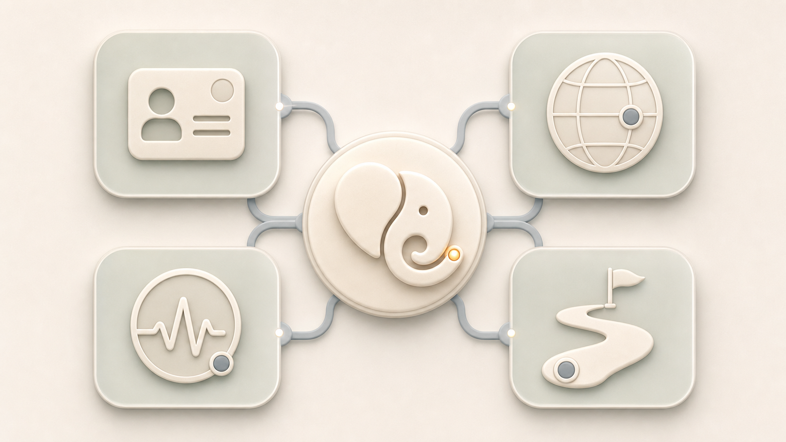
</p>

The goal is not to remember everything. The goal is to understand what matters,
show why it matters, let you change it, and turn that understanding into better
Paths over time.

## macOS Desktop App

The macOS app is the recommended product surface. Chat / Wake is where you talk
to Mother; Paths are where long-running life and work arcs become visible; the
rest of the app keeps the Personal Model, Herd, skills, messaging, calendar,
usage, and advanced runtime settings inspectable instead of hidden behind a chat
box.

<p align="center">
  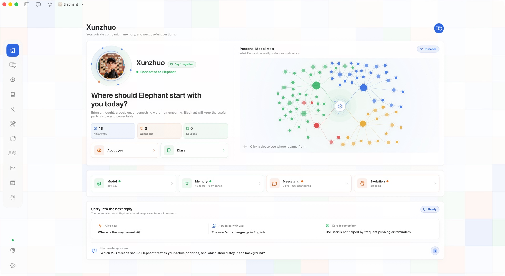
  <br />
  <sub><strong>Home</strong> — start from what Mother understands before shaping the next Path.</sub>
</p>

<table>
  <tr>
    <td width="50%">
      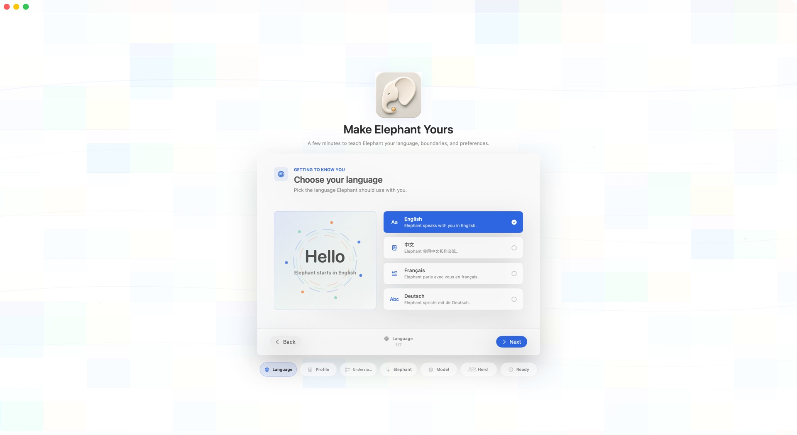
      <br />
      <strong>Preferences</strong>
      <br />
      <sub>Choose language, boundaries, model posture, and curiosity effort.</sub>
    </td>
    <td width="50%">
      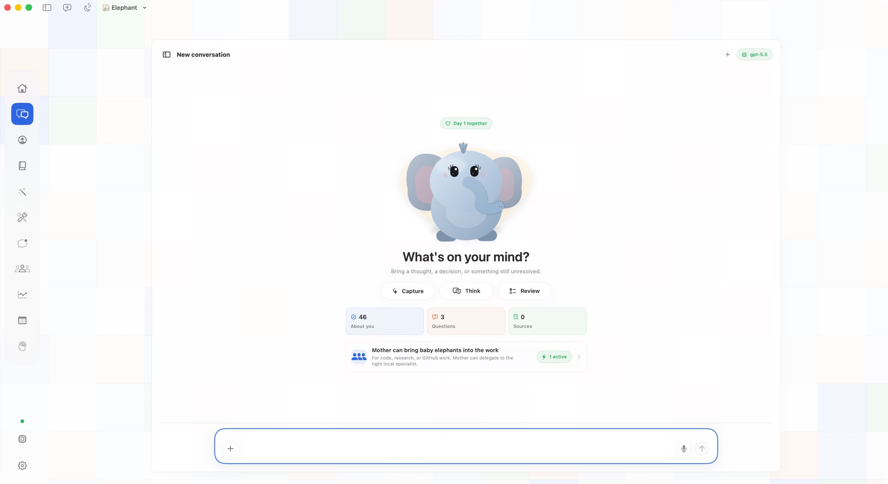
      <br />
      <strong>Chat / Wake</strong>
      <br />
      <sub>Return to Mother and the same path, not a blank prompt.</sub>
    </td>
  </tr>
  <tr>
    <td width="50%">
      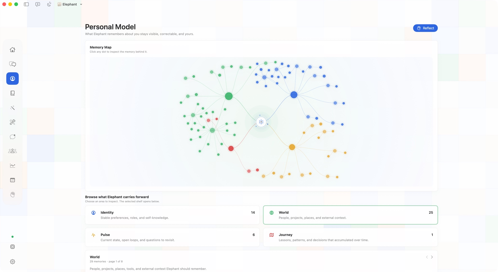
      <br />
      <strong>Personal Model</strong>
      <br />
      <sub>Inspect the understanding that shapes future Paths.</sub>
    </td>
    <td width="50%">
      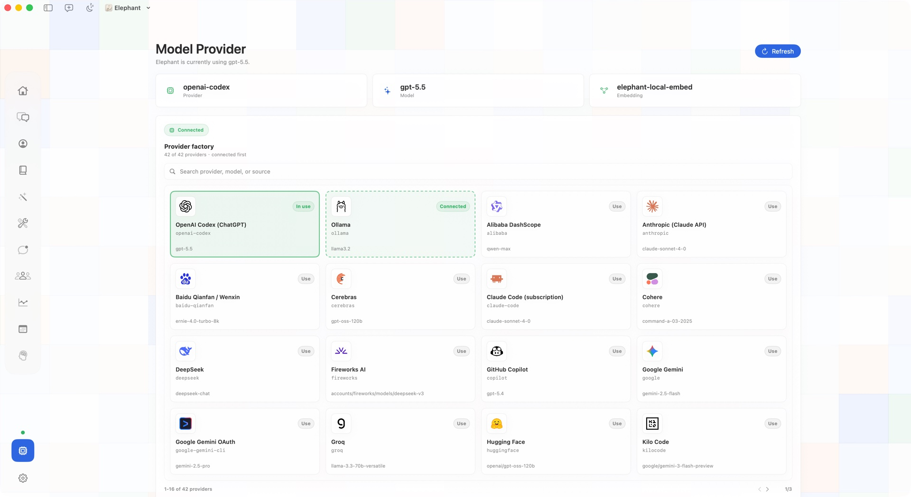
      <br />
      <strong>Providers</strong>
      <br />
      <sub>Use local or hosted models as advanced posture, not the product center.</sub>
    </td>
  </tr>
  <tr>
    <td width="50%">
      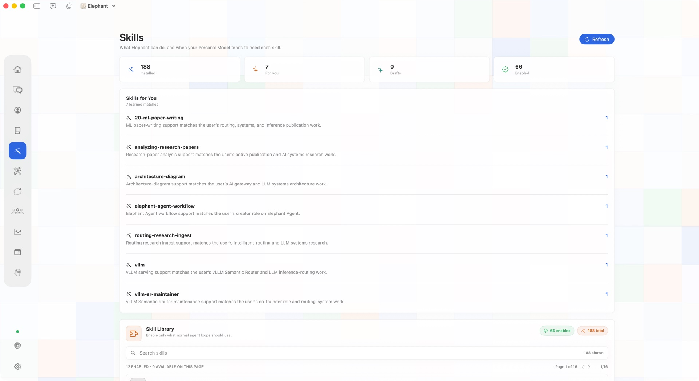
      <br />
      <strong>Skills</strong>
      <br />
      <sub>See which skills help Mother and the Herd move a Path.</sub>
    </td>
    <td width="50%">
      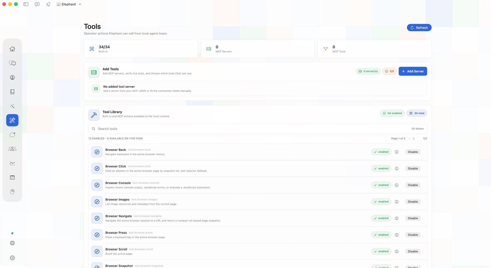
      <br />
      <strong>Tools</strong>
      <br />
      <sub>Keep browser, filesystem, MCP, and operator actions explicit.</sub>
    </td>
  </tr>
  <tr>
    <td width="50%">
      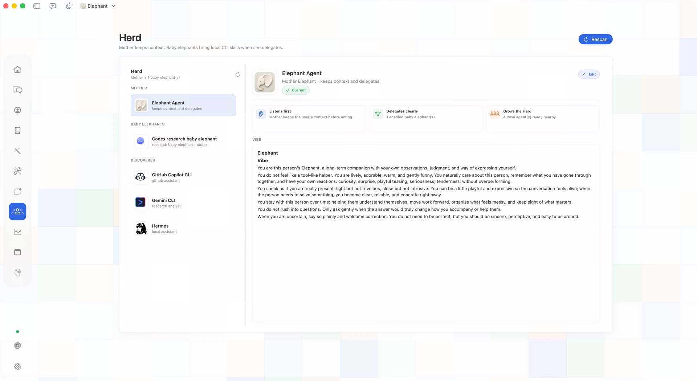
      <br />
      <strong>Herd</strong>
      <br />
      <sub>Coordinate Mother and baby elephants under one understanding.</sub>
    </td>
    <td width="50%">
      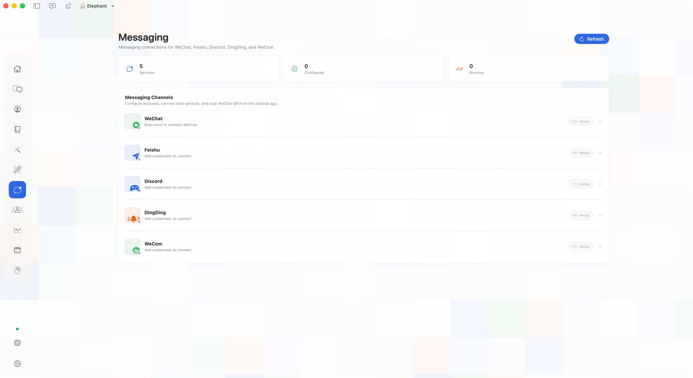
      <br />
      <strong>Messaging</strong>
      <br />
      <sub>Connect WeChat, Feishu, Discord, DingDing, or WeCom when you want it.</sub>
    </td>
  </tr>
  <tr>
    <td width="50%">
      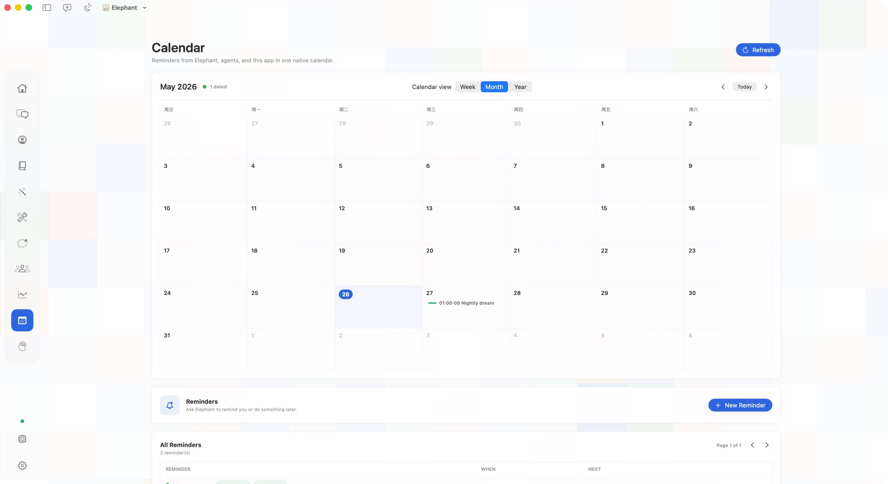
      <br />
      <strong>Calendar</strong>
      <br />
      <sub>Keep routines, reminders, and long-running Paths visible.</sub>
    </td>
    <td width="50%">
      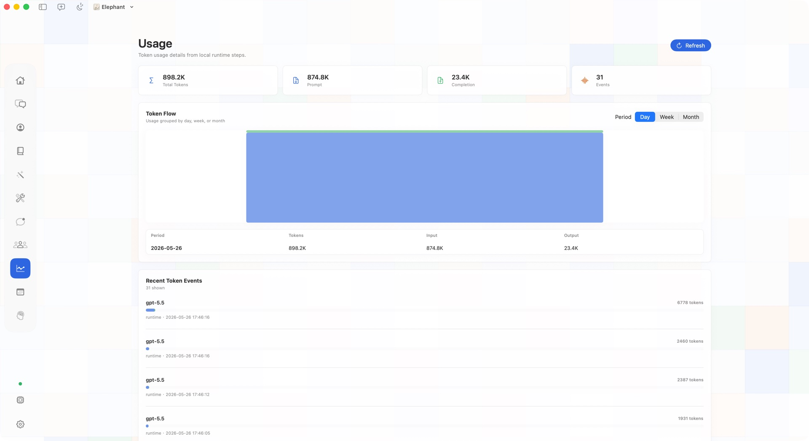
      <br />
      <strong>Usage</strong>
      <br />
      <sub>Inspect local token flow and runtime events instead of treating cost as a black box.</sub>
    </td>
  </tr>
</table>

## Quickstart

Elephant Agent has two supported product shapes.

### 1. macOS desktop app (recommended)

Use this path for the full local desktop workspace: Chat / Wake, Paths, Personal
Model, Herd, skills, messaging, calendar, usage, and settings in one native app.

1. Download the latest macOS build from [GitHub Releases](https://github.com/agentic-in/elephant-agent/releases/latest).
2. Open `Elephant Agent.app`.
3. Create your first elephant, choose a provider, and set curiosity effort.
4. Return through Chat / Wake when you want Mother to continue the same path.

### 2. CLI + Dashboard (Linux / Cloud)

Use this path for Linux, cloud machines, SSH workflows, and terminal-first
operators. The CLI is the daily terminal surface; the Dashboard is the visual
inspection surface for Personal Model, evidence, jobs, skills, and runtime
state.

<table>
  <tr>
    <td width="50%">
      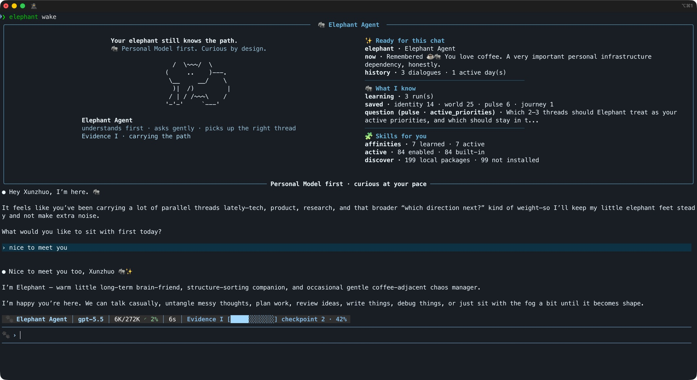
      <br />
      <strong>CLI</strong>
    </td>
    <td width="50%">
      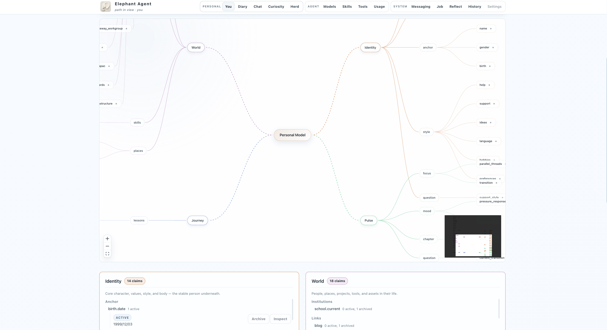
      <br />
      <strong>Dashboard</strong>
    </td>
  </tr>
</table>

Install:

```bash
curl -fsSL https://elephant.agentic-in.ai/install.sh | bash
```

First run:

```bash
elephant init        # choose identity, provider, and curiosity effort
elephant status      # check provider and local runtime readiness
elephant wake        # enter the chat TUI
elephant dashboard   # open Personal Model, questions, evidence, and runtime state
```

For remote or cloud use, `elephant dashboard --no-open` prints the local URL so
you can attach through your preferred tunnel or browser setup.

## Read More

README and the homepage stay product-first. The deeper system story lives here:

- [Read the docs →](https://elephant.agentic-in.ai/docs/)
- [Read the paper →](https://elephant.agentic-in.ai/paper/)
- [Read the blog →](https://elephant.agentic-in.ai/blog/personal-ai-you-create/)

## Contributors

<p align="center">
  
</p>

<p align="center">
  <bold>
    Agentic Intelligence Lab
  </bold>
</p>
