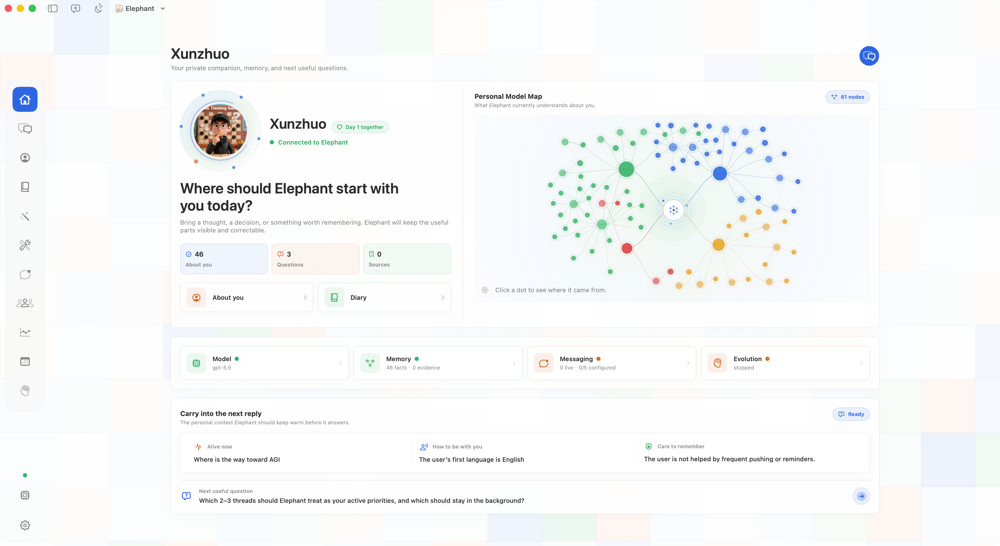
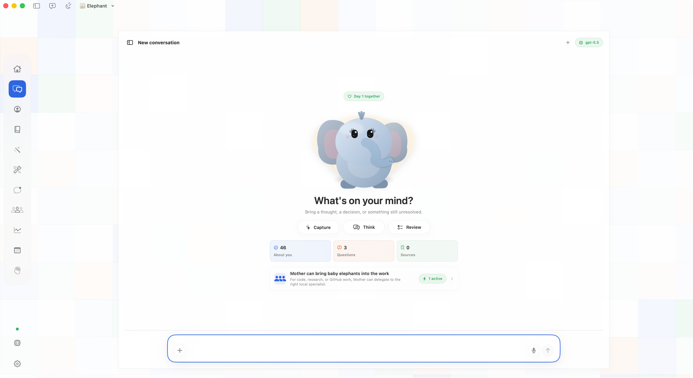
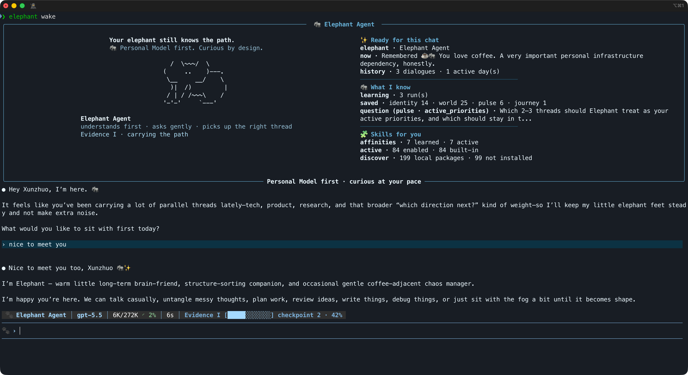
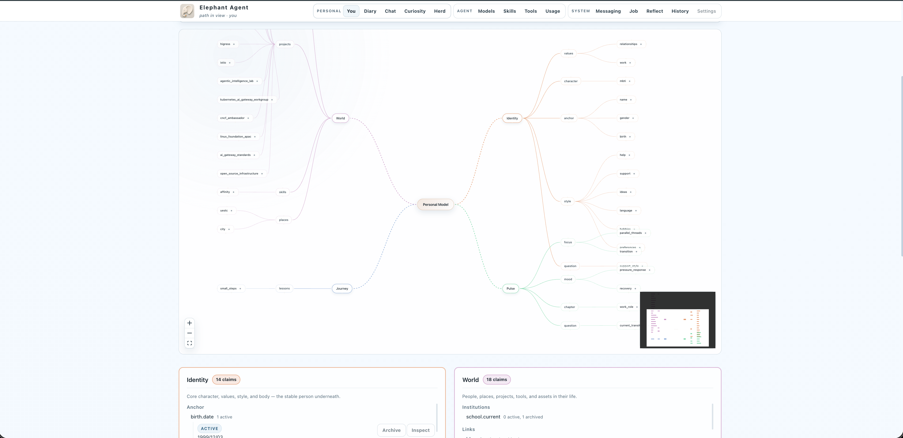

<p align="center">
  
</p>

<div align="center">
  <h1>Elephant Agent</h1>
  <p>
    <strong>Agency-first personal AI.</strong><br />
    A correctable Personal Model for Identity, World, Pulse, and Journey.
  </p>
  <p>
    <a href="https://elephant.agentic-in.ai/">Website</a>
    ·
    <a href="https://elephant.agentic-in.ai/blog/personal-ai-you-create/">Blog</a>
    ·
    <a href="https://elephant.agentic-in.ai/paper/">Paper</a>
  </p>
</div>


## What It Is

Elephant Agent is **agency-first personal AI**.

It keeps one durable object at the center: a correctable, evidence-backed
**Personal Model** of what should shape future help. Tools, skills, memory,
messaging, cron jobs, and background learning orbit that model instead of
replacing it.

The product position is **L4 personal AI**: agents may do more work, but the
person should not lose judgment, continuity, or growth in the process.

## Personal Agent Levels

| Level | Core question | Public examples | Elephant stance |
|---|---|---|---|
| **L1 — Do work** | Can AI execute tasks? | Claude Code, Cursor, Devin, Codex-style agents. | Useful capability, not the center. |
| **L2 — Carry context** | Can the agent stop starting over? | [OpenClaw](https://openclaw.ai/) publicly emphasizes local agents, persistent memory, full system access, skills, plugins, and integrations. | Required foundation; memory supports the Personal Model. |
| **L3 — Improve procedures** | Can the agent evolve skills and workflows? | [Hermes Agent](https://hermes-ai.net/) publicly positions itself around a self-improving learning loop, skill creation, recall, and user modeling. | Important downstream layer; skills stay visible and governed. |
| **L4 — Grow the person** | Can personal AI return judgment, evidence, questions, and reflection to the user? | Elephant Agent's product position. | The Personal Model should help the person do more without thinking less. |

## Personal Model

- **Identity** — who you are, your values, boundaries, decision style, and stable preferences.
- **World** — the people, projects, tools, places, and relationships around you.
- **Pulse** — what is alive right now: focus, pressure, constraints, energy, and priorities.
- **Journey** — what your path has taught: lessons, failures, recovery patterns, and long-running growth.

<p align="center">
  
</p>

The goal is not to remember everything. The goal is to understand what matters,
show why it matters, and let you change it.

## What It Does

| Capability | What it means |
|---|---|
| **Correctable claims** | Remember, correct, forget, dispute, and inspect why a claim exists. |
| **Evidence-backed recall** | Conversation search and embeddings provide support, but retrieved text does not become truth by itself. |
| **User-paced curiosity** | Quiet, balanced, or active questions appear only when an answer would improve future help. Silence wins. |
| **Background reflect** | Episode-close, diary, dream, and manual jobs turn lived Steps into governed Personal Model updates. |
| **Visible skills and tools** | Skills, tools, models, messaging, and cron jobs remain inspectable capabilities around the Personal Model. |

If Elephant Agent cannot find reliable Personal Model support, `no_match` is a
feature, not a failure.

## Quickstart

Elephant Agent has two supported product shapes.

### 1. macOS desktop app (recommended)

Use this path for the full local desktop workspace: Wake, You, Diary, Reflect,
Jobs, Skills, Settings, and the Personal Model map in one native app.

<p align="center">
  
</p>

1. Download the latest macOS build from [GitHub Releases](https://github.com/agentic-in/elephant-agent/releases/latest).
2. Open `Elephant Agent.app`.
3. Create your first elephant, choose a provider, and set curiosity effort.
4. Return through Wake when you want to continue the same path.

### 2. CLI + Dashboard (Linux / Cloud)

Use this path for Linux, cloud machines, SSH workflows, and terminal-first
operators. The CLI is the daily work surface; the Dashboard is the visual
inspection surface for Personal Model, evidence, jobs, skills, and runtime
state.

<p align="center">
  
</p>

<p align="center">
  
</p>

Install:

```bash
curl -fsSL https://elephant.agentic-in.ai/install.sh | bash
```

First run:

```bash
elephant init        # choose identity, provider, and curiosity effort
elephant status      # check provider and local runtime readiness
elephant wake        # enter the chat TUI
elephant dashboard   # open You, Questions, and Evidence
```

For remote or cloud use, `elephant dashboard --no-open` prints the local URL so
you can attach through your preferred tunnel or browser setup.

## Read More

README and the homepage stay product-first. The deeper system story lives here:

- [Read the docs →](https://elephant.agentic-in.ai/docs/)
- [Read the paper →](https://elephant.agentic-in.ai/paper/)
- [Read the blog →](https://elephant.agentic-in.ai/blog/personal-ai-you-create/)

## Contributors

<p align="center">
  
</p>

<p align="center">
  <bold>
    Agentic Intelligence Lab
  </bold>
</p>
