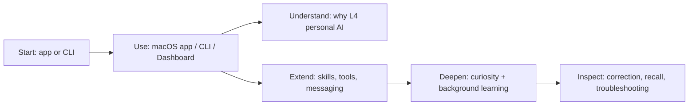

# Overview

Elephant Agent helps you hand work to agents without handing over your
judgment.

Most agent products optimize for doing tasks faster. Elephant Agent adds the
missing loop: a correctable **Personal Model** of what matters to you, what has
evidence, what is still a question, and what should shape future help.

That is the L4 position. L1 agents execute tasks. L2 agents carry context. L3
agents improve procedures. Elephant Agent's position is L4: personal AI should
make the person more capable over time, not just automate more sessions.

The mechanism is a correctable **Personal Model**. Memory is the beginning, not
the product. The center is what Elephant Agent currently understands about your
**Identity**, **World**, **Pulse**, and **Journey**, with source evidence and
open questions close enough to inspect and correct.

:::tip Start here
If you are on macOS, start with the desktop app. If you are on Linux, cloud, SSH,
or a terminal-first setup, install CLI + Dashboard, run `elephant init`, then
return through `elephant wake`.
:::

## Choose your path

| If you want to... | Read this first | What you will understand |
| --- | --- | --- |
| Start using Elephant Agent | [Quickstart](./getting-started/quickstart.md) | Choose macOS app or CLI + Dashboard. |
| Use the primary product | [macOS app](./user-interface/macos.md) | Chat / Wake, Personal Model, providers, skills, tools, herd, messaging, reminders, usage, and settings in one workspace. |
| Use a terminal or remote machine | [CLI / Chat TUI](./user-interface/cli-tui.md) | How `elephant`, `init`, `wake`, slash commands, and `dashboard --no-open` fit together. |
| Inspect what it knows | [Dashboard](./user-interface/dashboard.md) | How Personal, Agent, and System pages map to implementation surfaces. |
| Understand the thesis | [Why Elephant Agent](./philosophy/overview.md) | Why L4 personal AI keeps judgment, evidence, questions, and growth with the person. |
| Extend what it can do | [Skills](./capacities/skills.md) and [Tools](./capacities/tools.md) | How visible capabilities orbit the Personal Model. |

## The core idea

| Product bet | What it means | Where to go deeper |
| --- | --- | --- |
| **Agency first** | Elephant Agent should preserve the user's judgment and growth while agents do more work. | [Why Elephant Agent](./philosophy/overview.md) |
| **Personal Model first** | Elephant Agent keeps an explicit, inspectable model of what it understands, rather than treating every retrieved memory as truth. | [Personal Model first](./philosophy/design-principles.md) |
| **Curious by design** | It does not wait for you to explain everything forever. It may ask when a missing or stale answer would change future help. | [Proactive curiosity](./learning/proactive.md) |
| **Correctable understanding** | Claims can be remembered, corrected, forgotten, disputed, and traced back to evidence. | [Correctable understanding](./learning/correctable.md) |
| **Continuity across surfaces** | macOS app, CLI, Dashboard, messaging, jobs, skills, tools, and recall all orbit the same local understanding system. | [Continuity](./capacities/continuity.md) |

## The docs map

## How Elephant Agent is organized

| Area | Product question | Main docs |
| --- | --- | --- |
| Personal Model | What does Elephant Agent understand about the person? | [Personal Model first](./philosophy/design-principles.md), [Memory](./capacities/memory.md) |
| Memory architecture | What becomes durable truth, what stays evidence, and what is recalled only for the current turn? | [System model](./philosophy/system-model.md), [Memory](./capacities/memory.md), [Embeddings](./capacities/embeddings.md) |
| Daily surfaces | Where do I talk to it, inspect it, and correct it? | [macOS app](./user-interface/macos.md), [CLI / Chat TUI](./user-interface/cli-tui.md), [Dashboard](./user-interface/dashboard.md) |
| Visible capabilities | What can it reach for without becoming a feature shelf? | [Skills](./capacities/skills.md), [Tools](./capacities/tools.md), [Messaging](./capacities/messaging.md) |
| Learning loops | How does understanding deepen over time? | [Proactive curiosity](./learning/proactive.md), [Background learning](./learning/background.md), [Correctable understanding](./learning/correctable.md) |

## Design source of truth

These docs are the public operator guide. The deeper repository architecture
truth lives in the system-design docs and the paper:

- [System layer model](https://github.com/agentic-in/elephant-agent/blob/main/docs/system-design/system-layer-model.md)
- [Paper](/paper/) for the outward-facing technical report
