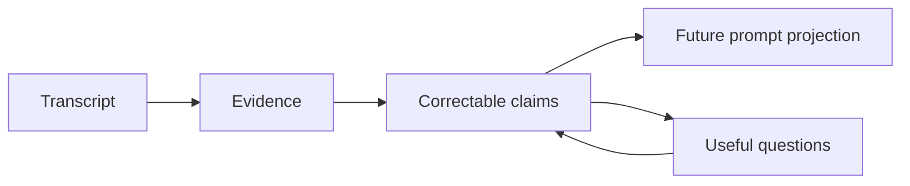

# Why Elephant Agent

Elephant Agent begins from a simple belief:

> Personal AI should help you do more without thinking less.

That is the agency-first position. The agent can execute more work, carry more
context, and improve more procedures, but the person should keep judgment,
evidence, questions, and growth.

## The level Elephant Agent is aiming at

| Level | What improves | Public examples | What remains insufficient |
| --- | --- | --- | --- |
| **L1** | Task execution. | Claude Code, Cursor, Devin, Codex-style agents. | Each task still needs human steering and review. |
| **L2** | Context continuity. | OpenClaw publicly emphasizes local agents, persistent memory, full system access, skills, plugins, and integrations. | Memory can carry context without improving the person's judgment. |
| **L3** | Procedures and skills. | Hermes Agent publicly positions itself around a self-improving learning loop, skill creation, recall, and user modeling. | Better procedures can still leave the user cognitively passive. |
| **L4** | The person. | Elephant Agent's product position. | Personal AI should keep judgment, evidence, questions, and growth with the user. |

Most agent systems still lose the thread in predictable ways. They can have a
long transcript, many tools, and even a memory feature, yet still fail to answer:
what should this agent reliably understand about the person it helps?

## The gap

| Common agent shape | What usually breaks | Elephant Agent's answer |
| --- | --- | --- |
| Stateless chat | Every session starts cold. | Durable elephants and wake/resume continuity. |
| Transcript memory | The system stores more text but understands less. | Active Personal Model claims with provenance. |
| Skill-first agent | Capability grows, but the person stays vague. | Skills orbit understanding instead of replacing it. |
| Hidden personalization | The user cannot see or correct what changed. | Claims, questions, and evidence stay inspectable. |
| Pushy autonomy | Proactive behavior becomes interruption. | Curiosity is visible, optional, and user-paced. |

## The core mechanism

Elephant Agent puts a **Personal Model** at the center. That model is not a
profile in the advertising sense. It is the current, correctable understanding
that helps future replies start from the right place.



The Personal Model is organized around four lenses:

| Lens | What it carries | Example shape |
| --- | --- | --- |
| **Identity** | Stable facts about who the person is and how to address them. | Name, language, role, boundaries. |
| **World** | People, projects, places, tools, and external context. | A repository, collaborator, team, or workspace. |
| **Pulse** | Current state, energy, priorities, and near-term pressure. | What is alive this week. |
| **Journey** | Longer arcs, decisions, lessons, and recurring patterns. | Why a direction changed, or what keeps returning. |

:::note
Memory is part of this system, but it is not the whole system. Recall can support
a current turn; it does not automatically become durable truth.
:::

## The public path

The supported path is intentionally small:

```bash
elephant init
elephant status
elephant wake
```

| Step | What happens | Why it matters |
| --- | --- | --- |
| `init` | Creates the first elephant and provider posture. | The relationship starts with identity and readiness. |
| `status` | Checks local runtime and model readiness. | The first real conversation starts from a known state. |
| `wake` | Opens the durable chat surface. | The same elephant can pick up the thread later. |

## What makes it different

Elephant Agent is not trying to win by having the longest transcript or the
largest tool shelf. It is trying to become **more yours over time**:

- it remembers through correctable claims, not opaque summaries
- it asks when a gap would improve future help
- it keeps silence honored when you do not answer
- it uses tools, skills, models, messaging, and jobs as visible capabilities
- it lets you inspect why a claim exists before you rely on it
