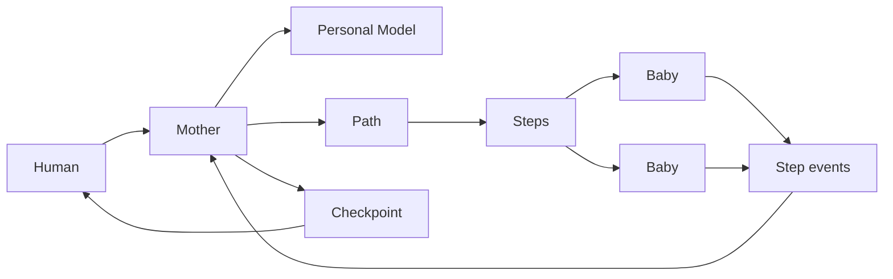

# Paths, Steps, and Herds

Elephant Agent should not feel like project management software with a friendlier
mascot. The product object is broader than a project because the human is
broader than work.

A **Path** is anything the user is trying to move or become more coherent around:
shipping a codebase, losing weight, rebuilding a habit, studying a field,
planning a career transition, repairing a relationship, recovering from drift, or
keeping a research line alive.

Mother understands first. Then she helps shape Paths.

## Product language

| Term | Meaning | Replaces |
| --- | --- | --- |
| **Mother** | The coordinating elephant that starts from the Personal Model. | Leader, manager, dispatcher. |
| **Path** | A long-running direction across life or work. | Project as the default concept. |
| **Step** | A concrete action that can move a Path. | Issue, task, ticket. |
| **Flow** | The visible state board for Steps. | Kanban as the primary user word. |
| **Checkpoint** | A moment where the user's judgment should return. | Review as a separate workspace. |
| **Herd** | The group of baby elephants that can help a Path. | Squad as a default user concept. |
| **Baby** | A bounded helper with skills, model posture, and runtime limits. | Sub-agent as the user-facing term. |

This vocabulary keeps the product open to personal growth. A software team can
still use a Path like a project, but a person can also use a Path for health,
learning, routines, or a life transition without feeling forced into enterprise
issue language.

## Path state

Flow states should stay simple and map cleanly to an internal state machine.

| User label | Internal meaning | Typical action |
| --- | --- | --- |
| **Later** | Not ready yet. | Keep the Step visible without pressuring it. |
| **Next** | Ready to pick up. | Mother or the user can choose it soon. |
| **Moving** | Actively being worked. | A human or baby is currently moving it. |
| **Checking** | Waiting for judgment. | Mother brings back a Checkpoint. |
| **Done** | Completed. | Preserve outcome and useful lessons. |
| **Stuck** | Blocked. | Ask, re-plan, or change helper. |
| **Dropped** | Intentionally stopped. | Keep the decision visible without treating it as failure. |

The board is not separate from chat. Chat can create or move Steps; the board can
also be dragged manually when state is easier to express visually.

## Trust modes

The product should keep trust simple:

| Mode | Product promise |
| --- | --- |
| **Ask First** | Mother can plan and draft, but asks before creating Paths, moving important Steps, assigning babies, or taking external action. |
| **Trust Mother** | Mother can keep moving inside the user's current boundaries, while risky or identity-shaping moves still become Checkpoints. |

These are user-facing modes, not a substitute for permission checks. Tools,
external integrations, destructive edits, purchases, commits, messages, and other
high-impact actions still need explicit policy and audit trails.

## Collaboration model

Babies should not coordinate through hidden peer-to-peer chatter by default.
Mother owns the coherent picture.

Each baby gets a bounded assignment and writes results back to the Step timeline.
Mother reads those events, updates the Path, and decides whether to continue,
ask, reassign, or create a Checkpoint.

## Long-running Paths

Long-running work should be modeled as many bounded runs, not one endless agent
process. A Path may last months, but each run should have:

- a clear Step
- a runtime owner
- a heartbeat
- cancellation and pause behavior
- a resumable checkpoint
- a visible event log
- a result that Mother can summarize back into the Path

This lets Elephant Agent support slow personal change without pretending that a
single background agent can safely run forever.
